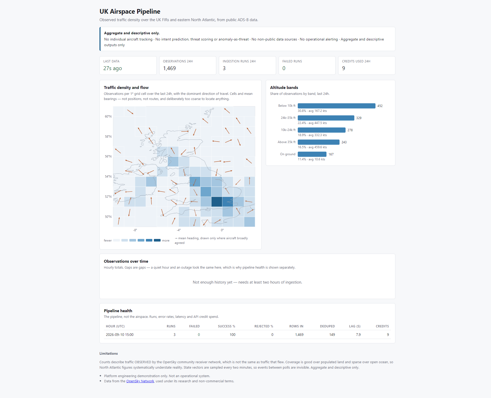

# UK Airspace Pipeline

[](https://github.com/hecmeynell-debug/uk-airspace-pipeline/actions/workflows/ci.yml)

A data engineering pipeline that ingests **public** ADS-B data for the UK
Flight Information Regions and the eastern North Atlantic, lands it with full
provenance, transforms it with dbt, and publishes **aggregate, descriptive**
datasets for situational awareness and resilience analysis.

> **All data used here is publicly broadcast ADS-B, retrieved through the
> OpenSky Network's documented public API. This repository is a platform
> engineering demonstration and a portfolio artefact. It is not an operational
> system, not a decision-support tool, and must not be deployed or presented
> as either.**

**It does not do individual aircraft tracking, intent prediction, threat
scoring, or any military-specific analytics.** Those are hard non-goals, not
unimplemented features — see [CONSTRAINTS.md](CONSTRAINTS.md).

## Why it exists

To demonstrate production engineering habits on a real, messy, rate-limited
public data source: idempotent loads, provenance on every record,
least-privilege database roles, tested transformations, structured logging,
and CI — rather than to produce analytics.

## Architecture

```
OpenSky /states/all   (public, OAuth2, bounded bbox, scheduled poll)
        |
        v
Ingestion job         rate-limit aware client, retry with backoff,
        |             structured logs
        v
raw schema            append-only; ingestion timestamp + source metadata
(PostgreSQL 16)       on every row; natural-key uniqueness constraint
        |
        v
dbt Core              sources -> staging -> intermediate -> marts,
        |             tests at each layer
        v
marts                 hourly / daily aggregate counts and distributions
(PostgreSQL 16)
        |
        v
Read API + dashboard   FastAPI on the read-only role, marts only
```

Orchestrated by Apache Airflow, containerised with Docker Compose, tested with
pytest and dbt tests, built on GitHub Actions.



The reasoning behind every one of those choices — including the ones rejected
— is in [ADR-0001](docs/adrs/0001-opensky-and-overall-architecture.md).

## Status

Built in gated phases. Each phase is reviewed and signed off before the next
one starts.

| Phase | Scope | Status |
|---|---|---|
| 0 | Repository foundations, Postgres 16, least-privilege roles, ADR-0001 | ✅ Complete |
| 1 | OpenSky client, raw schema, idempotent ingestion, scheduled job | ✅ Complete |
| 2 | dbt Core: staging → intermediate → marts, late-arriving data handling | ✅ Complete |
| 3 | GitHub Actions CI, structured logging, row-count and lag checks | ✅ Complete |
| 4 | Cloud deployment, IaC, secrets management | Not started |
| 5 | Documentation, ADRs, portfolio packaging | Not started |

## Quickstart

Requires Docker and Docker Compose.

```bash
git clone <this-repo>
cd uk-airspace-pipeline

cp .env.example .env      # edit if you like; defaults work for local dev
docker compose up -d

docker compose ps         # postgres and dashboard should report (healthy)
```

The dashboard is at <http://127.0.0.1:8000>. It will say the marts are not
built until you have ingested data and run `dbt build` — see below.

Connect and confirm the bootstrap:

```bash
docker compose exec postgres psql -U postgres -d airspace \
  -c "\dn" -c "\du airspace_*"
```

You should see the `raw` schema owned by `airspace_owner`, and four
least-privilege roles. Tear down with `docker compose down`, or
`docker compose down -v` to also drop the data volume.

### Running an ingestion

```bash
python -m venv .venv && ./.venv/Scripts/python.exe -m pip install -e ".[dev]"

python -m ingestion.run --migrate    # apply schema migrations (runs as airspace_owner)
python -m ingestion.run --dry-run    # fetch and validate, write nothing
python -m ingestion.run --once       # fetch and load one snapshot
```

Run `--once` twice and the second load will report rows as duplicates rather
than inserting them. Idempotency is enforced by a primary key on
`(icao24, observed_at)` with `ON CONFLICT DO NOTHING`, so it holds regardless
of how many times, or how many workers, replay the same window.

Exit codes are distinct so a scheduler can respond appropriately: `0` success,
`1` failure, `2` rate limited (back off until the daily allowance resets),
`3` configuration or migration error.

```bash
./.venv/Scripts/python.exe -m pytest        # unit tests always; integration tests
                                            # skip if no Postgres is reachable
./.venv/Scripts/python.exe -m ruff check .
```

The integration tests truncate `raw.state_vectors`, so they refuse to run
against a database that already holds rows. Point them at a throwaway
database, or opt in explicitly:

```bash
AIRSPACE_ALLOW_DESTRUCTIVE_TESTS=1 pytest
```

### Running it on a schedule (Airflow)

Airflow lives in an overlay, so the base stack stays a single Postgres
container for anyone who just wants to read the repo or run the tests.

```bash
docker compose -f docker-compose.yml -f docker-compose.airflow.yml up -d --build
```

The UI is at <http://127.0.0.1:8080>. Two DAGs, both paused on creation:

| DAG | Schedule | Purpose |
|---|---|---|
| `airspace_migrate` | manual | Apply pending schema migrations. The only component that connects with DDL rights |
| `opensky_ingest` | `*/2 * * * *` | Fetch one snapshot and land it |

Trigger `airspace_migrate` once, then unpause `opensky_ingest`.

`catchup` is off, deliberately. OpenSky serves live state vectors (one hour of
history for registered users), so a catch-up run cannot retrieve the window it
is nominally filling — it would re-fetch *now* under an old logical date,
mislabel the data and spend credits for it. Gaps stay gaps, honestly.

Checking DAGs parse locally (CI asserts the same thing inside the built image):

```bash
docker compose -f docker-compose.yml -f docker-compose.airflow.yml \
  run --rm airflow-scheduler airflow dags list-import-errors
```

Ingestion code is baked into the image rather than mounted, so it matches the
commit CI built; only `./dags` is mounted. Rebuild after changing `ingestion/`.
Shut the overlay down with the same `-f` pair plus `down`.

> The overlay sets `SIMPLE_AUTH_MANAGER_ALL_ADMINS`, so the local UI has no
> login. That is a local-demo convenience and must not survive to Phase 4.

### Transforming the data (dbt)

```bash
pip install -e ".[transform]"
export DBT_PROFILES_DIR="$PWD/transform"

dbt deps  --project-dir transform
dbt build --project-dir transform     # runs models and every test
```

dbt connects as `airspace_transform`: it reads `raw`, owns the schemas it
builds, and has no write access to the landing zone. It cannot corrupt the data
it reads.

| Layer | Materialisation | Purpose |
|---|---|---|
| `staging` | view | One-to-one cleaning of `raw`. Renames, casts, unit conversions. No filtering |
| `intermediate` | view | Assigns a coarse grid cell and altitude band. The last layer where per-airframe identity exists |
| `marts` | table | `fct_airspace_activity_hourly` (density + flow), `fct_airspace_activity_daily`, `fct_ingestion_health`. Aggregates only |

**Late-arriving data.** An observation can land well after the hour it belongs
to — a poll at 12:01 returns positions stamped 11:58, and a retry after an
outage lands much older ones. Filtering incrementally on `ingested_at` would
collect those rows but leave the *hour* they belong to already built and now
wrong. So the hourly mart filters on `observed_at` with a lookback window
(`late_arrival_lookback_hours`, default 3) and uses `delete+insert` keyed on
`activity_hour`: affected hours are rebuilt wholesale rather than appended to.
Anything arriving later than the lookback is not half-merged silently — a
reconciliation test fails and tells you to `--full-refresh`.

**The aggregate-only constraint is enforced, not just documented.** Two
mechanisms, deliberately overlapping:

- `assert_marts_expose_no_aircraft_identity` inspects the built schema and
  fails if `icao24`, `callsign`, `squawk`, `origin_country`, raw coordinates or
  similar ever appear in a mart — whatever route they arrive by.
- `airspace_reader`, the credential a dashboard or read API would use, is
  granted `USAGE` on the marts schema and nothing else. It cannot read `raw`,
  `staging` or `intermediate`. A consumer built on it is *structurally* unable
  to reach per-airframe data, rather than merely choosing not to.

`origin_country` is on the forbidden list on purpose. Breaking traffic down by
country of registration would be ordinary aviation statistics in another
project; in a defence-adjacent one it invites exactly the reading this project
exists to avoid, and excluding it costs nothing.

### Dashboard and read API

`docker compose up -d` starts it alongside Postgres, at <http://127.0.0.1:8000>.
Interactive API docs at `/docs`.

| Endpoint | Returns |
|---|---|
| `/api/meta` | Region, source, limitations and the non-goals |
| `/api/activity/grid?hours=` | Observation density and dominant flow direction per 1° grid cell |
| `/api/activity/hourly?hours=` | Hourly observation totals |
| `/api/activity/altitude?hours=` | Profile by altitude band |
| `/api/activity/daily?days=` | Daily profile with a coverage measure |
| `/api/pipeline-health?hours=` | Runs, error rates, latency, credit spend |
| `/health` | Liveness of the service itself, independent of the pipeline |

**The map shows density and flow, not flights.** Each cell carries an
observation count and a *circular mean* of the headings observed in it, drawn
as an arrow. That answers "which way is traffic moving through here" — the
North Atlantic tracks, the approach flows into the southeast — at the level of
a grid cell, without any aircraft existing in the output.

Three details matter more than they look:

- **Headings cannot be averaged arithmetically.** 350° and 10° average to 180°,
  pointing exactly backwards, while looking entirely plausible. The mean is
  computed as `atan2` over averaged sin/cos components. There is a test for
  precisely this case.
- **Arrows are suppressed where they would be noise.** Alongside the mean, each
  cell stores a *resultant length* from 0 to 1 — how much the headings agreed.
  Below 0.55, or fewer than three airborne observations, no arrow is drawn. A
  mean bearing over scattered headings is noise dressed as a finding.
- **The basemap is decoration.** Natural Earth 1:50m coastline, public domain,
  vendored into the repo by `scripts/vendor_coastline.py` rather than fetched
  at runtime. Nothing is computed from it.

If the grid were ever made finer than 1°, it would need a minimum-count
suppression threshold: a 0.25° cell holding one aircraft over open water
localises it to ~28 km, which is individual tracking arriving through the back
door of a fine enough grid.

Three further things are deliberate:

- **It holds only the reader credential.** The container is given
  `AIRSPACE_READER_PASSWORD` and no other — not the owner, ingest or transform
  password. It cannot read `raw`, `staging` or `intermediate`. Serving
  per-airframe data is not something the endpoints decline to do; it is
  something this service *cannot* do, and a test asserts the denial.
- **No third-party JavaScript.** Every chart is hand-rolled inline SVG, so the
  page works offline and pulls in no CDN supply chain.
- **Every window parameter is bounded**, so no URL edit turns a dashboard query
  into a bulk export. Tested with out-of-range values.

The container runs as a non-root user (uid 10001).

### Observability

```bash
python -m ingestion.run --check      # exit 0 healthy, 1 if any check fails
```

Five checks, each of which has been driven into its failing state by a test —
a monitoring check only ever seen passing is a decoration:

| Check | Fails when |
|---|---|
| `freshness` | No row has landed in 3 polling intervals |
| `run_failure_rate` | Over 20% of runs failed in the last hour |
| `no_stuck_runs` | A run has sat in `running` for over 15 minutes |
| `reject_rate` | Over 1% of received rows were malformed |
| `credit_budget` | Over 90% of the daily API allowance is spent |

`fct_ingestion_health` carries the same signals as an hourly mart — run counts,
success and reject rates, latency, credit spend. Every log line is JSON, so
`ingest.completed`, `healthcheck.result` and the rest are greppable.

**Everything monitored here is about the pipeline.** Freshness, row counts,
error rates, latency, credit spend. Nothing alerts on airspace *content* — no
volume anomalies, no "unusual activity" thresholds. That is a hard non-goal,
not an unimplemented feature, and a change adding one should be rejected on
sight.

[docs/failure-modes.md](docs/failure-modes.md) documents what breaks, how you
find out, and what to do — including the ones with no remedy, like coverage
gaps being indistinguishable from an absence of traffic.

### Continuous integration

Three jobs on every push and pull request:

| Job | What it does |
|---|---|
| `lint` | `ruff check` and `ruff format --check` |
| `test` | Brings up the project's own compose stack, applies migrations, runs `dbt build`, then the full pytest suite |
| `dags` | Builds the real Airflow image and parses the DAGs inside it, asserting `catchup` stays off and `max_active_runs` stays 1 |

CI uses the repo's own `docker-compose.yml` rather than a GitHub service
container, so it exercises the same Postgres image, the same bootstrap script
and the same least-privilege roles that ship here. A service container would
test a database this project never uses.

### OpenSky credentials

Ingestion (Phase 1) runs anonymously by default, which is enough for a smoke
test. For sustained use, register at
[opensky-network.org](https://opensky-network.org), create an API client, and
set `OPENSKY_CLIENT_ID` / `OPENSKY_CLIENT_SECRET` in `.env`. The API uses
OAuth2 client credentials; username/password authentication is no longer
accepted.

## Limitations

Read these before drawing any conclusion from the output.

- **Observed traffic, not actual traffic.** OpenSky is a community receiver
  network. Coverage is good over populated land and sparse over open ocean, so
  North Atlantic counts systematically understate reality. Every aggregate
  describes what was *observed*, and coverage varies by time and place.
- **ADS-B is not universal.** Aircraft without ADS-B Out, or with transponders
  off or transmitting incomplete data, are absent. Some fields (callsign,
  altitude, velocity) are frequently null.
- **Sampled, not continuous.** State vectors are polled every 120 seconds, so
  short events between polls are invisible. This is a rate-limit consequence,
  documented in ADR-0001.
- **No identity resolution.** `icao24` is used only as a deduplication key
  inside the `raw` schema. Nothing per-airframe is published.
- **Not real time.** Batch pipeline with a scheduled cadence. It is not, and
  will not become, an alerting or monitoring system for airspace content.

## Data source, licence and attribution

Data from the [OpenSky Network](https://opensky-network.org), used under its
terms for **research and non-commercial purposes**. This repository is
non-commercial.

If you use this work in a publication, cite the OpenSky Network paper:

> Matthias Schäfer, Martin Strohmeier, Vincent Lenders, Ivan Martinovic,
> Matthias Wilhelm. *Bringing Up OpenSky: A Large-scale ADS-B Sensor Network
> for Research*. ACM/IEEE IPSN, 2014, pp. 83–94.

## Repository layout

```
ingestion/      OpenSky client, load jobs and health checks
scripts/        one-off utilities (coastline vendoring)
transform/      dbt Core project
api/            read API and dashboard (reader role only)
dags/           Airflow DAGs
tests/          pytest unit and integration tests
db/init/        database bootstrap: roles, schemas, grants
db/migrations/  raw schema migrations
docker/         API and Airflow images
docs/adrs/      architecture decision records
docs/failure-modes.md   what breaks, and what to do
CONSTRAINTS.md  hard non-goals and definition of done
```

## Constraints

The hard non-goals, how each is enforced in practice, the legal position and
the Definition of Done are all in [CONSTRAINTS.md](CONSTRAINTS.md). They are
not negotiable within this project.
